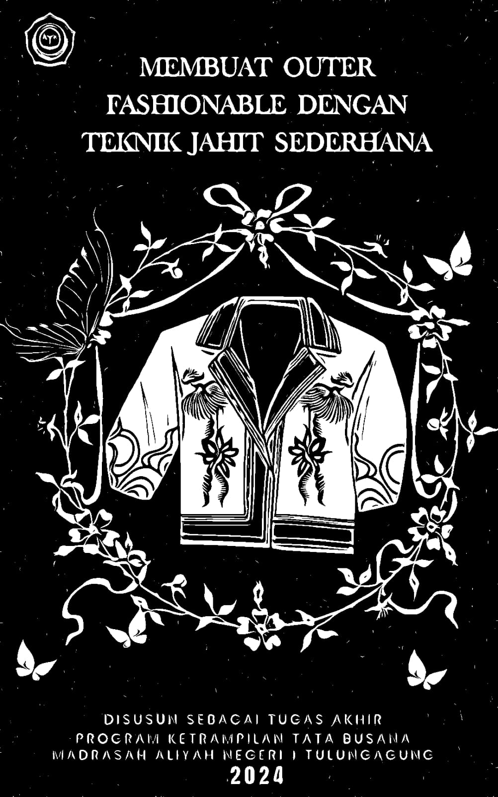

## Hi kawan Namaku Dansz 👋

<!--
**Dansz497/Dansz497** is a ✨ _special_ ✨ repository because its `README.md` (this file) appears on your GitHub profile.

Here are some ideas to get you started:

- 🔭 I’m currently working on ...
- 🌱 I’m currently learning ...
- 👯 I’m looking to collaborate on ...
- 🤔 I’m looking for help with ...
- 💬 Ask me about ...
- 📫 How to reach me: ...
- 😄 Pronouns: ...
- ⚡ Fun fact: ...
-->

- 🔭 saya sekarang sedang menempuh pendidikan di **Universitas Brawijaya** ...
- 🌱 saya suka mempelajari banyak hal walaupun itu susah **_@primsu17_** ...
-

# 👾✨ Welcome to My Futuristic GitHub Universe! ✨👾

  

---

<h1 align="center" style="color:#00fff7; font-family: 'Orbitron', sans-serif; letter-spacing: 2px;">Hi, I'm [Danzs] 👽</h1>

---

## 🪐 About Me

> "Exploring the digital cosmos, one commit at a time..."

- 🚀 **Role:** [3D Animator,Prompt Writer,Story Writer,Editor / Intermediate]
- 🧬 **Interests:** [Something New]
- 🌌 **Currently Learning:** [Programing Lenguage]
- 🤖 **Fun Fact:** [I like Corn Not Rice]
- 📫 **Contact:** [**_@primsu17_**](https://www.instagram.com/primsu17?igsh=amkyMndjYjltaXlq)

---

## 🛠️ My Tech Stack

  
  
  
  
  <!-- Tambahkan badge lain sesuai kebutuhan -->

---

## 🌠 Featured Projects

| Project                                                                                                          | Description     | Preview                                  |
| ---------------------------------------------------------------------------------------------------------------- | --------------- | ---------------------------------------- |
| [Project Name](https://github.com/Dansz497/Dansz497/blob/1233d05a913091a362f91d6fa353a79c5c8b4596/Reignite.docx) | Filosofi Diriku |  |
| [Project Name](#)                                                                                                | Team Work       |         |

---

## 📊 GitHub Stats

  
  
  

---
